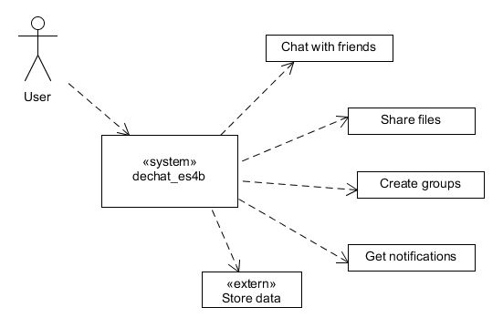

[[section-system-scope-and-context]]
== System Scope and Context

=== Business Context

[role="arc42help"]
****
There are different functions in the application.

[options="header"]
|===
| Functions  | Definition
| Chat with friends|  Exchange messages with another user.
| Share files | Send files like pictures, videos or other kinds of files to your friends.
| Create groups| You can create a group of users for chatting with them like you do with a friend.
| Get notifications| When some friend wants to chat with you. You will receive a notification.
| Store data| This function needs connection to your PODs. It saves the data into your private POD when you send a message or a file.
|===

****
=== Technical Context

[role="arc42help"]
=== TO BE DONE
