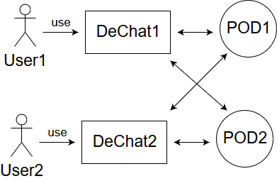

[[section-building-block-view]]

== Building Block View

[role="arc42help"]

=== Whitebox Overall System

DeChat is a descentralized chat created with SOLID. SOLID is a project led by Tim Berners-Lee wich aims to change the way Web Apps work today.
To make this posible, as a first part of the project, SOLID has created SOLID Pods. In a future stage of the development these pods will not be
neccesary.

After this introduction, let's talk about our project and how all will work.
The App will have three main elements: pods, users and DeChat App. These parts will comunicate with each other.

- User: users will use DeChat App to comunicate to other users.
- DeChat App: the app will provide all the funcionality to users and will comunicate with SOLID Pods.
- SOLID Pods: they will work as an intermediary between the diferent apps of users.

=== Level 2

[role="arc42help"]
****
_TO BE DONE_
****

=== Level 3

[role="arc42help"]
****
_TO BE DONE_
****